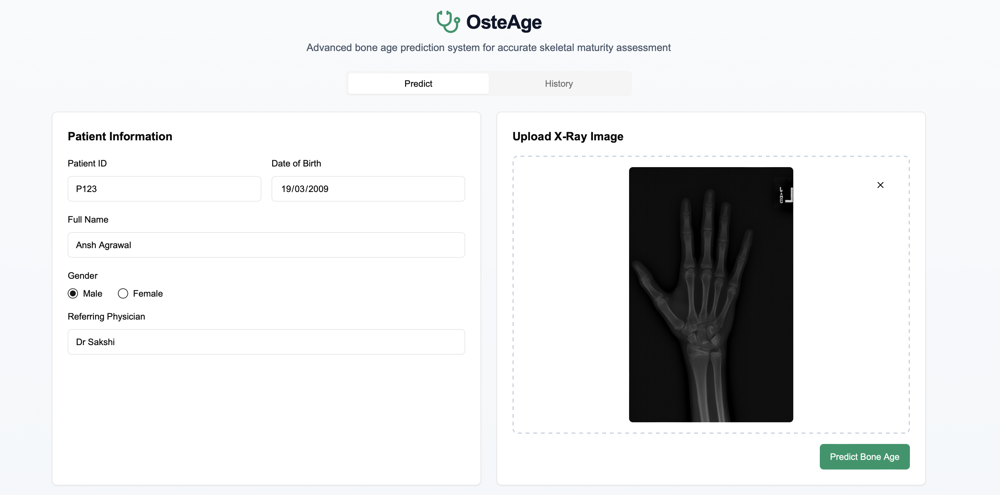
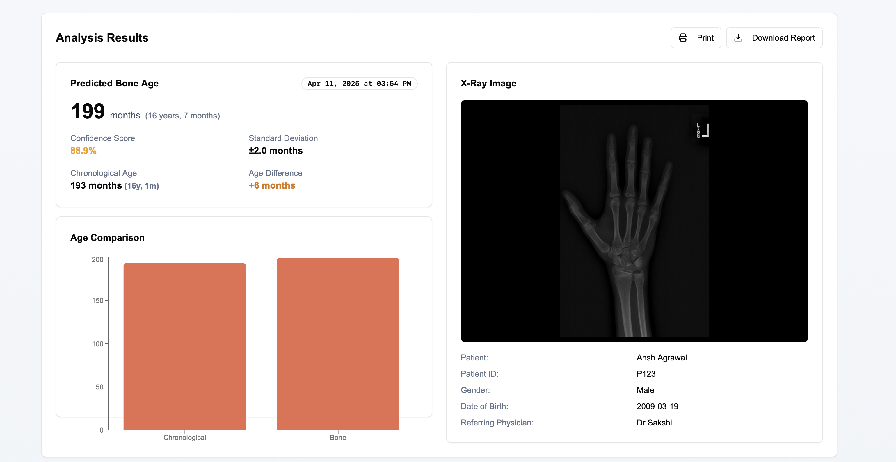
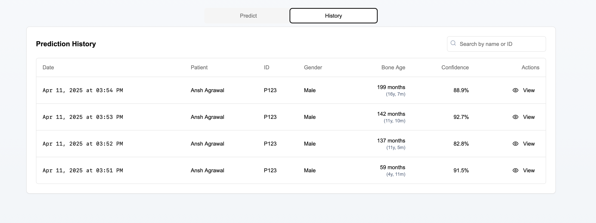

# 🦴 OsteAge: Bone Age Prediction System

An advanced AI-powered system for bone age prediction using hand X-ray images. Built for medical professionals to assess skeletal maturity, this web platform combines a sleek frontend with powerful deep learning capabilities.

---

## 🔍 Features

- 📸 Upload hand X-ray images for analysis
- 🤖 AI-based prediction of bone age (in months & years)
- 📊 Visual comparison of predicted vs chronological age
- 🧠 Confidence score & standard deviation
- 📁 Patient history tracking and report generation
- 🖨️ Download or print analysis reports

---

## 📸 Screenshots

<p align="center">
  
</p>

<p align="center">
  
</p>

<p align="center">
  
</p>

---

## 🧪 Tech Stack

- Frontend: Next.js (App Router), Tailwind CSS, TypeScript
- Backend: Python (FastAPI/Flask-ready), TensorFlow/Keras
- Other Libraries: Chart.js (visualizations), Formik (form handling)

---

## 🚀 Getting Started

```bash
# 1. Clone the repository
git clone https://github.com/yourusername/osteage.git

# 2. Navigate to the project directory
cd osteage

# 3. Install frontend dependencies
npm install

# 4. Run frontend
npm run dev

# 5. Start backend (in backend folder)
cd backend
source venv/bin/activate  # or activate your virtualenv
python main.py
```

---

## 📌 Notes

The ML model file (.keras) is large and excluded via .gitignore.

---

## 🤝 Contributing

1. **Fork the repo**
2. **Create a branch**: `git checkout -b feature/FeatureName`
3. **Commit your changes**: `git commit -m 'Add feature'`
4. **Push**: `git push origin feature/FeatureName`
5. **Open a Pull Request**

---

## 📬 Contact

For any questions, suggestions, or collaborations, feel free to reach out:

- Name: Ansh Agrawal
- Email: anshagrawal148@gmail.com
- GitHub: AnshAggr1303

